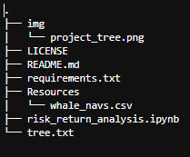

# <a id="Top-of-Page">Welcome to the Risk-Return Analysis Tool!</a>
#### An investment option evaluator
***
## <a id="Contents">Cotents</a>
[Project Description](#Project-Description) 
[Technologies](#Technologies) 
[Installation Guide](#Installation-Guide) 
[Usage](#Usage) 
[Contributors](#Contributors) 
[License](#License) 
[Bottom of Page](#Bottom-of-Page) 
***
## Project Description<a id="Project-Description">
This project models automated risk-retrun evaluations for investment options inclusion in client portfolios. Using this tool, we determine the fund with the most investement potential based on key risk-management metrics: the daily returns, standard deviations, Sharpe ratios, and betas.

#### A summary of what's under the hood:
Using Jupyter notebook, this tool analyzes return data for four investment options:
 - Soros Fund Management LLC
 - Paulson & Co. INC
 - Tiger Global Management LLC
 - Berkshire Hathaway INC 

The following sequential stages are then applied across each investment option:
1. Analyze the performance
2. Analyze the volatility.
3. Analyze the risk.
4. Analyze the risk-return ratio.
5. Diversify the portfolio. 
    
A brief descritpion of each stage is noted below.

#### Analyze the Performance
Analyze the data to determine if any of the porfolios outperform the broader stock market (in this case, S&P 500).
1. Visualize the daily returns of each fund portfolios and the S&P 500.
2. Calculate and visualize the cumulative returns for the four portfolios and the S&P 500. 

##### Analyze the Volatility
Analyze the volatility of each of the four fund portfolios and the S&P 500.
1. Visualize the daily return data for each of the four portfolios and the S&P 500 (using box plots). 
    
#### Analyze the Risk
Evaluate the risk profile of each portfolio using standard deviation (std) and the beta.
1. Calculate the std for each of the four portfolios and for the S&P 500.
2. Calculate the annualized std for each of the four portfolios and for the S&P 500.
3. Visualize the daily returns with a 21-day rolling window of the four portfolios and for the S&P 500. 

#### Analyze the Risk-Return Profile
Determine the Sharpe ratios for each portfolio.
1. Calculate the annualized average return data for the four fund portfolios and for the S&P 500.
2. Calculate the Sharpe ratios for the four fund portfolios and for the S&P 500.
3. Visualize the Sharpe ratios for the four funds and for the S&P 500 (using bar charts). 

#### Diversify the Portfolio
Evaluate how the portfolios react relative to the broader market.
1. Calculate the variance of the S&P 500 using a 60-day rolling window. 
2. Given 2 chosen portfolios, calculate the beta of the portfolios.
3. Calculate the average value of the 60-day rolling beta of the portfolios.
4. Visualize the 60-day rolling beta of the portfolios. 
    
#### Summary
Given the noted analsis, we then can determine which portfolio is most sensitive to the broader market and which portfolio is recommended for inclusion in a firm's suite of fund offerings.
    
#### Project layout:
The layout of essentials for this project is show below.

***
## Technologies<a id="Technologies">

<a href="https://docs.python.org/release/3.7.10/" title="https://docs.python.org/release/3.7.10/">
<a href="https://numpy.org/doc/stable/" title="https://numpy.org/doc/stable/">
 

<a href="requirements.txt" title="requirements.txt">Requirements List</a>
***
## Installation Guide<a id="Installation-Guide">
To install <a href="https://github.com/jasonjgarcia24/risk-return-analysis" title="github.com/jasonjgarcia24/price-dislocation">risk-return-analysis</a>, type <code>git clone https://github.com/jasonjgarcia24/risk-return-analysis.git</code> into bash in your prefered local directory.  
Alternatively, you can navigate to the same address (<code>https://github.com/jasonjgarcia24/risk-return-analysis.git</code>) and download the full <code>main</code> branch's contents as a zip file to your prefered local directory. 

***
## Usage<a id="Usage">
Observe risk-return-analysis with <code>risk_return_analysis.ipynb</code>. No input variables are required. 

***
## Contributors<a id="Contributors">
Currently just me :) 
***
## License<a id="License">
Each file included in this repository is licensed under the <a href="https://github.com/jasonjgarcia24/risk-return-analysis/blob/main/LICENSE" title="github.com/jasonjgarcia24/risk-return-analysis/blob/main/LICENSE">MIT License.</a>
***
[Top of Page](#Top-of-Page) 
[Contents](#Contents) 
[Project Description](#Project-Description) 
[Technologies](#Technologies) 
[Installation Guide](#Installation-Guide) 
[Usage](#Usage) 
[Contributors](#Contributors) 
[License](#License) 
